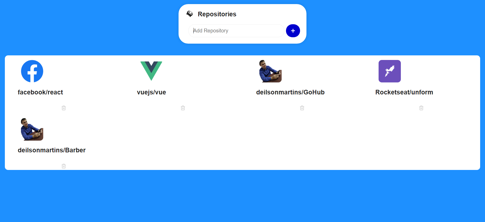
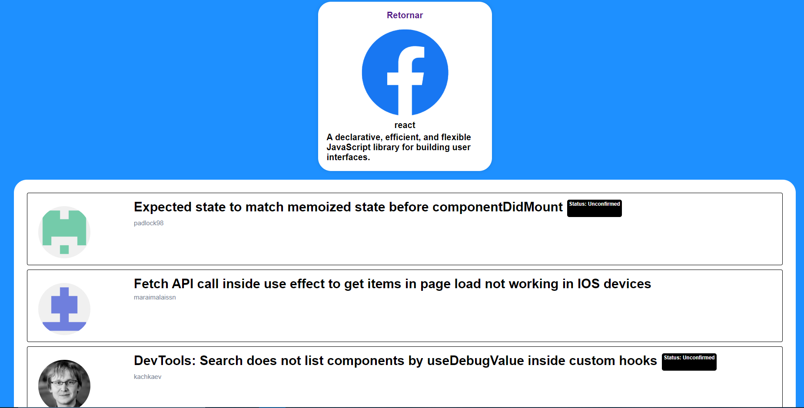

<h3 align="center">
  GoHub
</h3>

<h3 align="center">
  #rocketseat, #react, #yarn
</h3>

  

  

  <a href="#rocket-sobre-a-aplicação">Sobre a Aplicação</a>&nbsp;&nbsp;&nbsp;|&nbsp;&nbsp;&nbsp;
  <a href="#rocket-tecnologias-utilizadas">Tecnologias Utilizadas</a>&nbsp;&nbsp;&nbsp;|&nbsp;&nbsp;&nbsp;
  <a href="#rocket-instalação-e-execução"> Instalação e Execução</a>&nbsp;&nbsp;&nbsp;|&nbsp;&nbsp;&nbsp;
   <a href="#rocket-como-contribuir">Como Contribuir</a>

## :rocket: Sobre a Aplicação

Este projeto é um mecanismo de pesquisa de repositórios no GitHub para visualizar os últimos cinco issues.

## :rocket: Tecnologias Utilizadas
- **React** — Uma biblioteca para construir interfaces
- **Axios** — Requisições de API

## :rocket: Instalação e Execução

Faça um clone desse repositório.

1. A partir da raiz do projeto;
2. Rode `yarn` para instalar as dependências;
3. Rode `yarn start` para iniciar o client.

## :rocket: Como Contribuir

- Faça um fork desse repositório;
- Cria uma branch com a sua feature: `git checkout -b minha-feature`;
- Faça commit das suas alterações: `git commit -m 'feat: Minha nova feature'`;
- Faça push para a sua branch: `git push origin minha-feature`.
